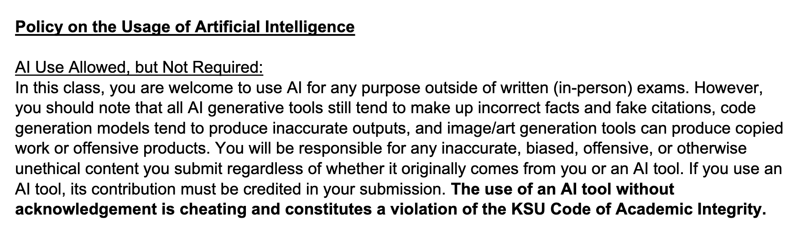
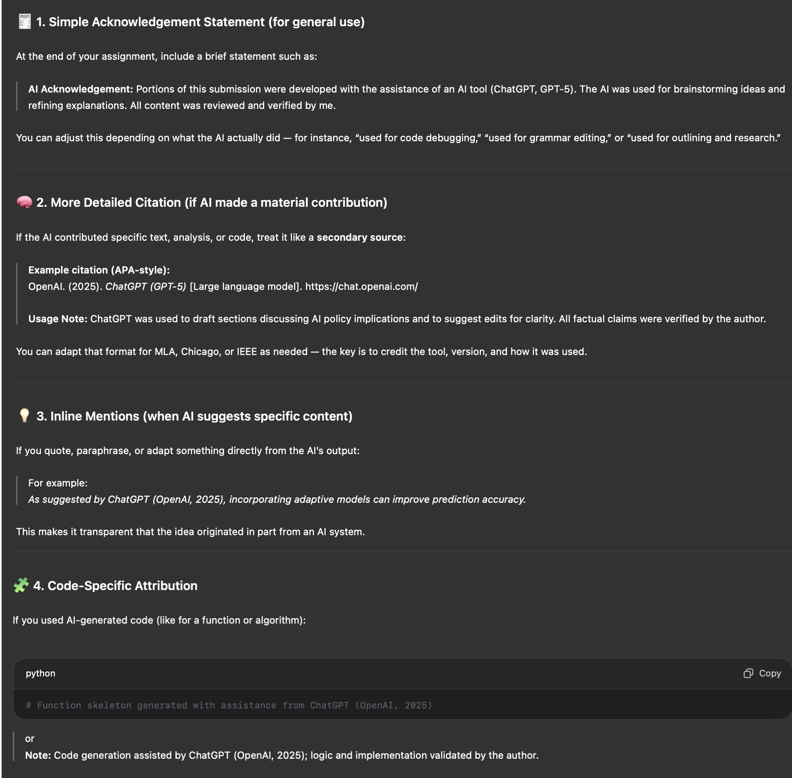

[< Back to Project Overview](README.md#implementation)

# Implementation Instructions and Rubric

Finally, you are ready to produce your application! You have planned most of the semester and you know exactly what to make.

Now you will execute the requirements by implementing your User Interface Design and Technical Design. Your goal is to make your implementation look as close to the User Interface Design as possible.

## Requirements

For the Implementation phase, you will produce and submit via GitHub:

- Operational, well-written code that follows your language's style guide. For example, do not use Java conventions in a Python app. Your implementation must perform all of the Must Have requirements including data storage to CSV, JSON, or SQL. You must be able to start and restart the application and all data that was created/entered remains available on restart.
- A well-written, well-organized  **README.md** *in the root of your source coode* linked from your main GitHub repo's project documentation that includes:
   - a brief description of your application (from an end-user point of view),
   - environment requirements, such as "MacOS or Linux or Windows" (be very specific the systems and operating systems where you application can run),
   - steps to clone and build the application on a fresh machine. Be very specific - I will be attempting to follow these steps on my machine and they better have all of the steps, dependencies, gotchas, database schema scripts, warnings, etc. I need to get your application working without a lot of fuss.
   - any other important information you need to pass along to someone trying to setup and run your application.
- Optionally, you can provide a video presentation showing the working application and any important notes how to setup and execute the application. If you are confident I can get your application working, you do not need to produce this.

#### Code That Does Not Compile Gets a 25% Grade or Lower, automatically

**It is essential that your code compiles**, even if it does not achieve every requirement. Do not submit code that will not compile. Fix it before submitting. If I cannot compile it, I cannot grade it. Have everyone on the team verify it compiles and check the README.md in the root of the source code to verify it explains how to get a successful compilation.

***Producing working code is our primary goal. Everything else we do in this field supports that goal.***

### Submission Steps

The entire team will work execute the implementation EFFORT. *All of you need* to review the completed work. This is a team effort and the team will succeed or fail as a group.

Our number one goal as Software Engineers is to deliver working software. All of the documentation, planning, and design were steps to reach a working implementation. This is the part that matters most. It also has the biggest contribution to your grade.

Your submission must include:

- *all* of your working source code within your team repository's `~/source` directory.
  - If your project also uses client-side compilation of SPA code, it must be part of your build process. I should not have to execute a dozen steps to compile your application. Script the build process via Bash if necessary. This will not affect most projects, but those of you who *chose* a more complex scenario must simplify the build process for your users. If you have an SPA that requires separate compilation, create multiple directories under `~/source` and a build script in the root of `~/source`.

- a `.gitignore` file in your `~/source` directory preventing checkin of compilation artifacts.
  - Do not add your `.gitignore` file last. Add it first. Otherwise, you have to manually go back and remove the things `.gitignore` tells the source control system to overlook.

- an `~/implementation/README.md` file with Environment Setup, Database Setup, How to Start and Login, and Troubleshooting.
  - Make grading your project easy (and put a smile on my face) by ensuring this document is complete, friendly, and well-organized.

### Grading Rubric

#### Component Percentages

1.  Login as User and Administrator: 10%
2.  Self-registration (User only): 10%
3.  Navigating, displaying, and searching available inventory: 20%
4.  Adding and removing available inventory from shopping cart: 10%
5.  Checkout process including payment acceptance and on-screen receipt: 20%
    - Purchased inventory *must* disappear from the available inventory, even after restarting the application. Storing your inventory status in memory is not acceptable.
6.  Sales report (administrator only): 10%
7.  README.md in the root of your source code - 20%

### UI Design Compliance (20% penalty)

I am not giving points for producing an exact rendition of your UI Design, but if it is vastly different (or your work looks awful), I will remove up to 20% from your total implementation grade. Judging this difference (and your reasons why it is different) is at my discretion. For best results, produce a project that is a reasonable execution of your UI Design submission.

Your UI Design set an expectation of what you would deliver. Students often misunderstand this point. It is a separate part of the project *and* what you plan to deliver in the implementation.

### Source Code (20% penalty)

I am not giving points for producing working, compiled source code that follows your language's coding style conventions. However, if you do not produce well-written source code that follows the appropriate style guide, I will remove up to 20% from your total implementation grade.

Write your code well.

### Extra Credit

Occasionally I award extra credit for something that impresses me. In the past I have awarded extra credit for:

- use of an ORM/relational mapper for building the database.
- wrapping the entire application in a Docker container to make running it a breeze
- hosting the application at Azure, Digital Ocean, etc.
- adding the ability to manage inventory (including images) from the Administration area

Do not count on extra credit. It is awarded at my discretion.

NOTE: If you do extra work, but do not complete the main application, then I will not offset the loss with extra credit. Finish the application you are committed to deliver, then do extra/cool stuff if you want.

### Goldplating

If you add complexity to the project with additional features, they must work. Do not make a simple app that works into a complicated app that fails. Goldplate your project with caution to avoid penalties.

### Components (80% of total)

-  90 to 100%: meets all requirements, well-coded, well organized, and highly professional. Polished work gets the top grade.
-  80% to 89%: meets all requirements, may have some coding or organizational issues.
-  70% to 79%: meets most requirements, may have some coding or organizational issues.
-  69% or below: does not meet most requirements or is very poorly coded.
-  50% or below: does not compile (even if it meets all or most other requirements).

*Note: Source code not posted to Github will not be graded. Also note that you are submitting source code - not a JAR file or EXE or other compiled artifact.*

#### `~/implementation/README.md` (20% of total)

-  90 to 100%: meets all requirements, well-written well organized, and highly professional. Polished work gets the top grade.
-  80% to 89%: meets all requirements, may have some minor graphical issues or organizational issues.
-  70% to 79%: meets most requirements, may have some minor graphical or organizational issues.
-  69% or below: does not meet most requirements or is very poorly drawn or contains incorrect information.

*Note: Documentation not posted to Github and linked to your Markdown will not be graded.*

### Academic Honesty

Your work must be your own. Do not plagiarize under any circumstances. All work is subject to review by TurnItIn, etc.

More importantly, this course is a waste of your time if you do not do the work yourself. If you are tempted to cheat, you need to ask yourself why you are here and what you hope to accomplish in your career if you get the grade, but have minimal ability to perform the work after you leave the University.

### Team Grading

Everyone on the team will receive the same grade with one exception. It follows.

Anyone not participating in the project may be removed from the team and have to perform the project alone. Before anyone can be "fired" from a team, I must meet with the *entire team* and hear what is happening. Do not fire anyone from your team without my explicit prior agreement.

#### AI Attribution

Many teams are using AI to generate documentation. It is *very* evident in some submissions. This is permitted, but you *must* (by KSU policy) give attribution when you use AI. This is stated in the syllabus. Ensure there is proper attribution like you would cite any source to avoid penalties. The following is from the course syllabus.

*If you use AI to generate code, produce proper citations in the source code where it was AI-generated.*

Here is the approach you must follow IF your team uses an AI for this project (this citation methodology was produced by ChatGPT, by the way 😀):

I recommend that you do not use AI to generate material for this project. That approach is taking away *valuable* experience you need to succeed in a very challenging job market.

Use AI to verify your work *after* you do it. Letting it do the work for you will leave you without concrete skills at graduation. Learn how to direct an AI to help you solve problems. Think of it as a smart employee that you need to coach, guide, and approve their work. If you have no expertise, you cannot manage the AI - it is managing you. 

An AI will produce the *best* results when weilded by an expert. Expertise is earned by doing the work. Letting the AI do the work is the easy route today and the hard route at graduation. Grades do not matter in the real world - only expertise.

---

[< Back to Project Overview](README.md#implementation)

